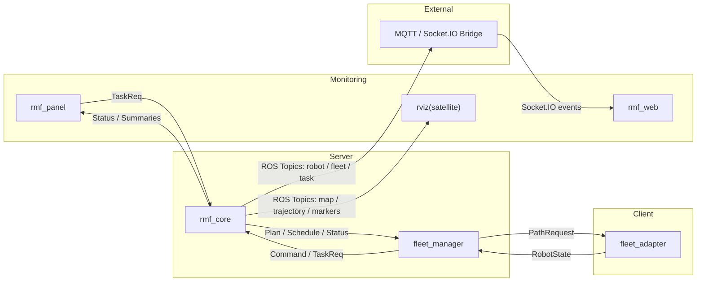

# RMF Server (RMF Core & Monitoring)

본 저장소는 **Open-RMF 기반 다중 로봇 관제 시스템**에서 **서버(Server)** 측 코드를 담당하는 패키지 모음입니다.  

- **역할**: 다중 로봇의 상태 수집, 작업/경로 스케줄링, 로봇/작업 모니터링 연동  
- **구성**: 서버 코어(RMF Core), 인터페이스(Fleet Manager), 외부 브릿지(MQTT/Socket.IO), 웹 대시보드(RMF Web), 웹 패널(RMF Panel), 시각화 툴(RViz), 맵 편집기(Traffic Editor), Docker 환경  
- **활용**: 실내/실외 로봇의 중앙 관제 및 다중 로봇 운영 최적화  

---

## 📌 1. 필요하게 된 상황
실외/실내 환경에서 여러 대의 로봇을 효율적으로 관리하려면, 개별 로봇만 잘 움직이는 것만으로는 충분하지 않습니다.  
- **중앙 관제 서버**가 모든 로봇의 상태를 실시간으로 수집하고, 충돌 없는 경로를 분배해야 함  
- **웹 대시보드와 연계**하여 운영자가 작업을 명령하고, 실행 상태를 모니터링해야 함  
- 실외/실내 환경의 **다양한 제약**(장애물, 위험 지역, 층간 이동 등)을 고려해야 함  

---

## 🔧 2. 시스템 구성
서버단(Server)에서는 다음과 같은 구성 요소로 동작합니다:

- **서버 코어 (`rmf_core`)**
  - 다중 로봇 작업 스케줄링과 경로 계획
  - 맵/교통 그래프(`building.yaml`)와 상태를 바탕으로 충돌 없는 운행 계산
  - 계획/스케줄 및 상태 관련 ROS 토픽 퍼블리시

- **인터페이스 (`fleet_manager`)**
  - 작업/경로 지시 전송, 로봇 상태 수집 및 로봇별 상태 관리
  - 좌표계 변환 지원(ex. 한국 좌표계 `EPSG:5174`)
  - 주요 엔드포인트: `/status`, `/navigate`, `/stop_robot`, `/action_paths`, `/start_activity`, `/toggle_teleop`, `/sub_robot_state`

- **외부 브릿지 (`rmf_demos_bridges`)**
  - MQTT/Socket.IO를 통한 클라우드 및 외부 모니터링 연계
  - 텔레메트리 데이터를 실시간 웹으로 전달

- **웹 대시보드 (`rmf-web`)**
  - 메인 관제 UI(작업 명령 및 로봇/작업 모니터링)
  - 구성 파일(`main.json`, `dashboard_config.json`)로 접속 엔드포인트 설정

- **웹 패널 (`rmf_demos_panel`)**
  - 경량 보조 패널(작업 명령 및 로봇/작업 모니터링)
  - ROS 디스패처/토픽/서비스 및 내부 WebSocket으로 상태 수신

- **시각화 툴 (`rviz` + `rviz_satellite`)**
  - ROS 네이티브 시각화(지도/로봇/경로/스케줄)
  - 위성 지도 오버레이로 실제 지형과 주행을 매칭

- **맵 편집기 (`rmf_traffic_editor`)**
  - `building.yaml` 제작/편집 도구
  - 실내/실외 맵과 교통 그래프(층/경로/인프라) 정의

- **Docker 환경**  
  - 전체 시스템을 컨테이너로 패키징하여 손쉽게 실행·배포 가능

---

## 🔀 3. 시스템 아키텍처 & 데이터 흐름


---

## 🚀 4. RMF Server 실행 가이드  

본 문서는 **서버단(Server) 코드**를 Docker Compose 기반으로 실행하기 위한 절차를 설명합니다.  

`rmf`, `api`, `dashboard`, `panel` 네 가지 서비스를 중심으로 빌드 및 실행 과정을 따라 하면 됩니다.

---

### 🧱 (1) 이미지 빌드

먼저 컨테이너 이미지를 빌드합니다.  

서비스별로 나눠 빌드할 수 있으며, 최초 1회만 실행하면 됩니다.

```bash
docker compose build iron    # ROS 2 Iron / Nav2 기반 이미지
docker compose build rmf     # RMF(sim 등) 관련 이미지
```

---

### ▶️ (2) 환경 준비

- **X11 표시 권한 부여**  

GUI 또는 시뮬레이터 실행 시 호스트의 X 서버 접근을 허용해야 합니다.  

리눅스 환경에서 다음 명령어를 실행합니다.  

```bash
xhost +    # 보안을 고려한다면: xhost +local:
```

- **.env 파일 생성 및 작성**  

컨테이너 실행에 필요한 환경변수를 `.env` 파일로 관리합니다.  

리포지토리 루트 디렉토리에서 다음 명령어로 `.env` 파일을 생성합니다.  

```bash
touch .env
# Example
ROS_DOMAIN_ID=123
DISPLAY=0
```

---

### 🚀 (3) 실행

필요한 서비스만 지정하여 실행할 수 있습니다.  

여기서는 `rmf`, `api`, `dashboard`, `panel`  서비스를 함께 실행합니다.  

```bash
# 포그라운드 실행 (로그를 바로 확인 가능)
docker compose up rmf api dashboard panel

# 백그라운드 실행 (로그는 별도로 확인)
docker compose up -d rmf api dashboard panel
```

---

### ⚙️ (4) 추가 사항

- **RViz Satellite 실행 가이드**
  - 위/경도, offset은 **Traffic Editor**에서 지정한 vector의 위경도와, build 후 생성되는 `0.yaml`을 참고
  - `rviz_satellite` launch 파일 실행 전, `demo.launch.xml`에 위/경도를 입력
  - `aerialmap_display.cpp`의 `x_offset`, `y_offset`을 입력
  - RViz 설정(`gl.rviz`)에 `- /AerialMap1`, `Class: rviz_satellite/AerialMap`을 추가
  - RViz Satellite 실행

- **Traffic Editor 맵 생성 가이드**
  - **Traffic Editor**로 층/경로/인프라 등 맵 요소 제작
  - `rmf_demos_maps/maps/<프로젝트명>/` 경로에 폴더 생성 후 `*.building.yaml` 파일 저장
  - `rmf_demos_dashboard_resources/<프로젝트명>/` 경로에 폴더 생성
    - `dashboard_config.json`, `main.json`을 기존 예시를 참고해 작성 (대시보드가 접속할 엔드포인트/레이어 정의)
  - `rmf_demos/config/<프로젝트명>/` 경로에 `*_config.yaml` 생성 (FSM/로봇 설정)
  - `rmf_demos/launch/` 경로에 `<프로젝트명>.launch.xml` 생성 (launch script) 